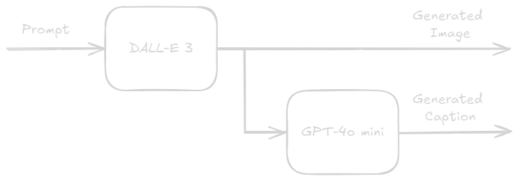

# AI Image & Caption Generator

This project is an AI-powered web application that generates images and captions based on user prompts. It leverages OpenAI's DALL-E for image generation and GPT-4o mini for creating engaging captions. The application is designed to present the generated image with a concise, Instagram-ready caption that describes the image, includes relevant hashtags, and ensures the content is suitable for Instagram. 

<div align="center">
  
</div>

## Preview
<div align="center">
  
</div>
<div align="center">
  
</div>

## Features

- **Image Generation**: Generate high-quality images based on text prompts.
- **Caption Generation**: Create engaging captions for the generated images.
- **Responsive Design**: A user-friendly interface that works on all devices.

## Technologies Used

- **Next.js**: A React framework for building server-side rendered applications.
- **TypeScript**: A strongly typed programming language that builds on JavaScript.
- **Tailwind CSS**: A utility-first CSS framework for styling the application.
- **OpenAI API**: Utilized for generating images and captions.

## Examples

### Example 1
**Prompt**: "A serene beach at sunset with palm trees and a clear sky."
**Generated Image**:

<div align="center">
  
</div>

**Caption**: "🌅✨ There’s nothing quite like the magic of a tropical sunset! As the sun dips below the horizon, painting the sky with breathtaking hues, let the gentle waves whisper tranquility into your soul. Embrace the beauty around you and let this serene moment remind you to find joy in the little things. 🌴🌊💖 #TropicalParadise #SunsetMagic #BeachVibes #NatureLovers #ChasingSunsets #Wanderlust #SereneMoments #OceanView #TravelGoals #FeelGoodVibes"

### Example 2
**Prompt**: "A bustling city street at night with neon lights and people walking."
**Generated Image**:
<div align="center">
  
</div>

**Caption**: "✨ Embrace the vibrant energy of the city as night falls! 💫 Each glowing light tells a story, and every street is full of potential adventures waiting to unfold. Let's wander and discover the magic that surrounds us! 🌃✨ Who's ready to create unforgettable memories under the neon lights? 💖 #CityVibes #NeonNights #UrbanExploration #AdventureAwaits #Cityscape #StreetStyle #EveningAmbiance #Wanderlust #ExploreMore #NightLife"

### Example 3
**Prompt**: "A cozy cabin in the mountains during winter with snow-covered trees."
**Generated Image**:
<div align="center">
  
</div>

**Caption**: "🏔️✨ Embrace the magic of winter coziness! This dreamy cabin nestled in a snowy wonderland is the perfect escape from the hustle and bustle. Picture yourself sipping hot cocoa by the fire, surrounded by twinkling lights and the peaceful hush of falling snow. ❄️ Take a moment to breathe in the serene beauty of nature and let it fill your heart with warmth. 🌟 What's your ideal winter getaway? #WinterWonderland #CozyCabin #SnowyDays #NatureLovers #FeelGoodVibes #ExploreTheWorld #WinterMagic #CocoaAndChill #PeacefulMoments"

### Example 4
**Prompt**: "A vibrant garden in full bloom with various colorful flowers."
**Generated Image**:
<div align="center">
  
</div>

**Caption**: "🌺✨ Embrace the beauty of nature! This vibrant garden is a reminder that life blooms in so many beautiful ways. 🌼🌿 Take a moment to breathe in the colors and let the radiant energy uplift your spirit. 🌈💖 Every step along this flowery path is a celebration of growth and positivity! Let's wander where the WiFi is weak and the flowers are plenty. 🌸🌞 #GardenGoals #NatureLovers #BloomWhereYouArePlanted #ColorfulNature #FloralJoy #ExploreMore #PeacefulMoments #InstaNature #FlowerPower #GetLostInNature"

### Example 5
**Prompt**: "A serene lake surrounded by autumn foliage with a small boat on the water."
**Generated Image**:
<div align="center">
  
</div>

**Caption**: "🏞️✨ Embrace the beauty of nature as vibrant autumn hues dance on the water! This tranquil scene reminds us to slow down and appreciate life’s simple pleasures 🌅. Let the reflections inspire your thoughts, and may the colors ignite your creativity. Take a moment to breathe in the serenity and soak in the magic all around us! 🍂🚣‍♂️ #AutumnVibes #NatureLovers #TranquilMoments #ExploreMore #FallColors #AdventureAwaits #ReflectionPerfection #PeacefulEscapes #BoatingLife #SerenityNow"

## Getting Started

### Installation

1. Clone the repository:
   ```bash
   git clone https://github.com/Juliandlb/Instagram-Post-Generator.git
   cd Instagram-Post-Generator
   ```

2. Install dependencies:
   ```bash
   npm install
   # or
   yarn install
   ```

3. Create a `.env.local` file and add your OpenAI API key:
   ```env
   OPENAI_API_KEY=your-api-key
   ```

### Running the Application

Start the development server:
```bash
npm run dev
# or
yarn dev
```

Open [http://localhost:3000](http://localhost:3000) with your browser to see the result.

## Usage

1. Enter a text prompt in the input field.
2. Click the "Generate" button.
3. Wait for the image and caption to be generated and displayed.
